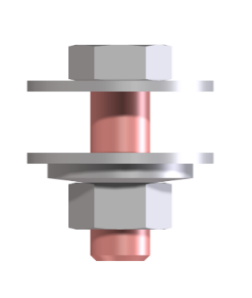
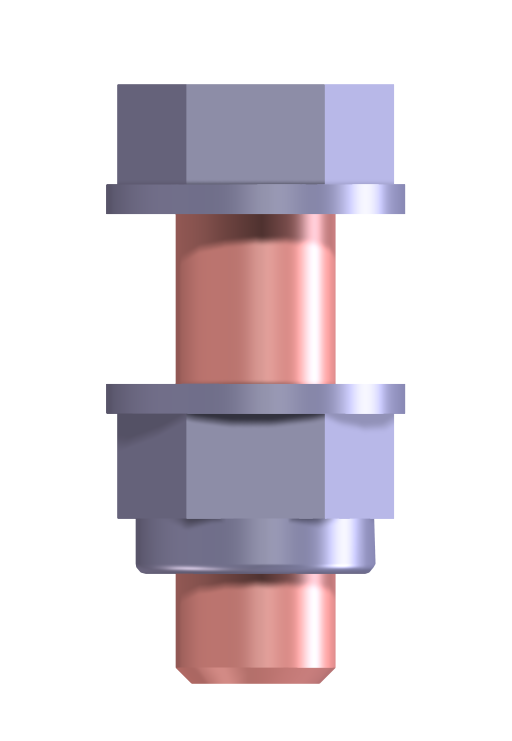
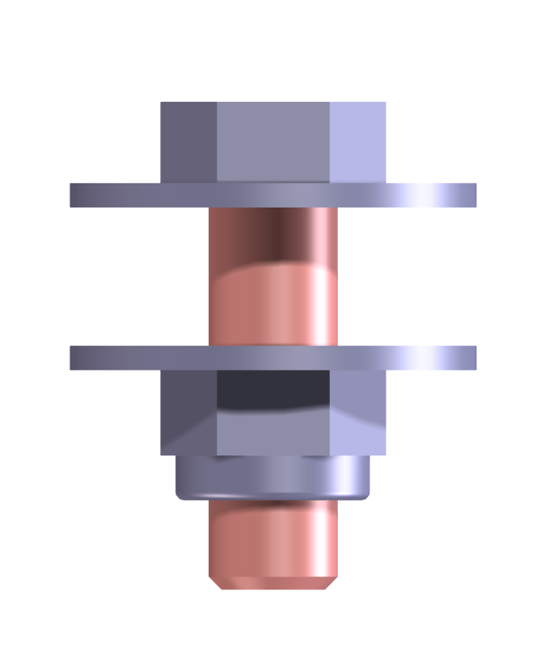
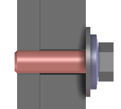
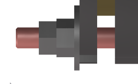
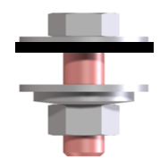

# Bolt connections

## General rules

- Only use SB bolts & nuts according to EN1090-2 when required
- Always use large washers in combination with conical spring washers to protect the paint and galvanisation
- Always use tens as a bolt length (e.g. 10, 20, 30, 100, ...)
- Always limit the amount of different bolt sizes in one project

## Fastener type

### Regular structure/platform build and machine mount to structure

Fasteners material: Hot dip Galvanized (HDGA)

{ width="140" .center }

| Component | Standard / norm |
| --- | --- |
| Hexagon head bolt | DIN 933 / DIN 931 |
| Hexagon nut | DIN 934 |
| Large plain washer | DIN 9021 |
| Conical spring washer | DIN 6796 |

### Structure/platform build and machine mount according to norm EN 1090-2

Fasteners material: Hot dip Galvanized (HDGA)

{ width="140" .center }

| Component | Standard / norm |
| --- | --- |
| SB bolt and nut | EN15048-1 |
| Large plain washer | ISO7093-1 with 200HV |
| Conical spring washer | DIN 6796 |

### Machine build

Fasteners material: electrolytic galvanizing (ELVZ) or INOX A2\*

=== "Hole"
    { width="140" .center }

=== "Slot"
    { width="140" .center }

| Component | Standard / norm |
| --- | --- |
| Hexagon head bolt | DIN 933 / DIN 931 |
| Hexagon locknut | DIN 985 |
| Regular plain washer | DIN 125 |
| Large plain washer | DIN 9021 |

\*Remark: Always mount INOX with copper grease.

**Internal thread**

{ width="140" .center }

| Component | Standard / norm |
| --- | --- |
| Hexagon head bolt | DIN 933 / DIN 931 |
| Large plain washer\* | DIN 9021 |
| Conical spring washer | DIN 6796 |

\*Special case: When there is not enough space for a large plain washer, use a small washer with Loctite 243 nutlock.

**Positioning bolts**

{ width="140" .center }

| Component | Standard / norm |
| --- | --- |
| Threaded rod or bolt | |
| 2x Hexagon nut\* | DIN 934 |
| (Large) plain washer | DIN 9021 / DIN 125 |

\*Use 2 regular nuts because there is no tension for spring washers.

!!! warning "Remark"
    When the machine is INOX and the structure is galvanized:

    → Use HDGA bolts but place PA washers (DIN9021) in between, plus a Fiber Klingersil C4324 2 mm sheet between machine and structure (see [Mounting machine(parts) on structures](Mounting-machine-parts-on-structures.md)).

    { width="140" .center }

## Choice of correct bolt length

The clamp length is the total thickness of the parts being bolted together. Add to it the value below for the chosen size and locking method to get the required bolt length.

| Size | with locknut | with springwasher |
| --- | --- | --- |
| M8 | 15 | 16 |
| M10 | 18.5 | 20 |
| M12 | 22.5 | 25 |
| M16 | 28 | 30 |
| M20 | 33.5 | 36 |
| M24 | 40 | 44 |

\* Remark: try to limit the additional thread to the minimal.

!!! tip "Basic rule to approach required bolt length"
    → Clamp length + diameter x 2
