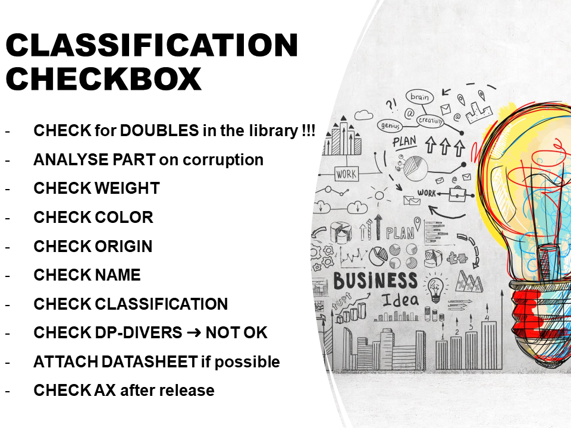

# Classification

## Classification checkbox

These are the criteria where commercial parts are checked for release approval.

## Approval planning

Parts open for approval will be checked daily in the morning by the key users. There is approximately half an hour planned daily for this, but this can vary by the amount of requests.

If there are any questions concerning classification, please prepare your question by mail with a detailed explanation of the problem, so they can refer back to you when possible.
