# Corrupt parts and how to solve them

Nowadays, we can load many kinds of 3D models into our drawing program. But many models coming from suppliers are drawn on a different program and have a different resolution. That can sometimes cause problems.

These models are corrupted and can have a big impact on loading, saving and adapting the drawing in 3D and 2D. In most cases the system will try to solve these parts by calculating the surfaces, but when there are a lot of corrupt parts, the system can't handle the process, goes into time-out and stops loading the package. This surely requires some attention.

Below you can find a roadmap for dealing with corrupted parts.

## How to detect a corrupted part

**Visual inspection**

When loading a part, it's mostly visible that the part is corrupt via the labels or cyan coloured faces or edges.

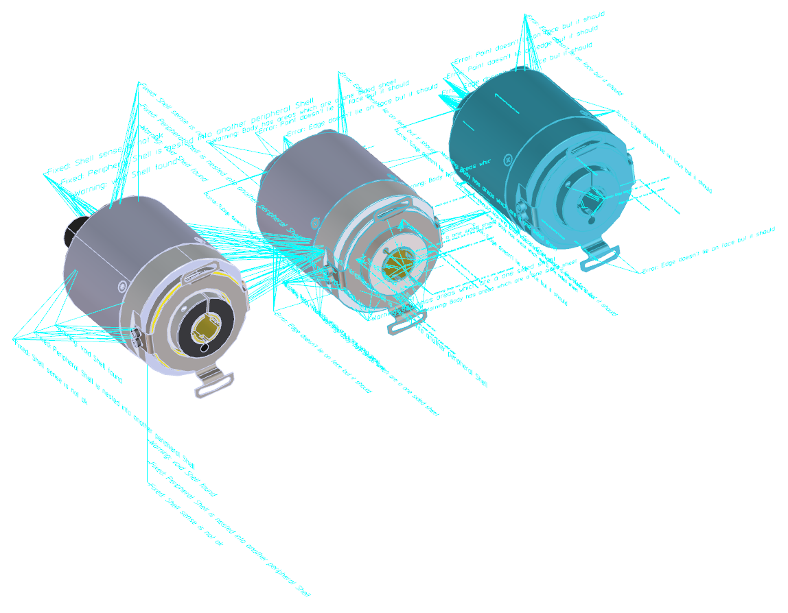

Transparent faces can also be an indication of face parts that can cause corruption.

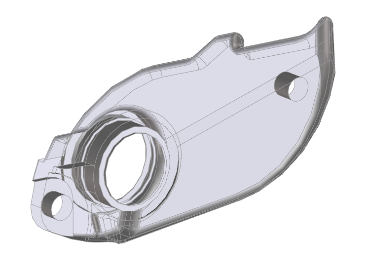

**Function 'Check Part'**

Sometimes it's less visually obvious that the part is corrupt, and that's why you should **always perform a 'check part' on any imported CAD file**.

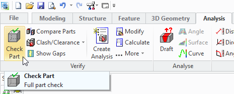

**Big files will take a long time to check.** If the file contains too much detail, please start with the simplification of the part as explained under [Simplification](#simplification).

By selecting the object and performing a Maximal check, the system will check the part for corruption.

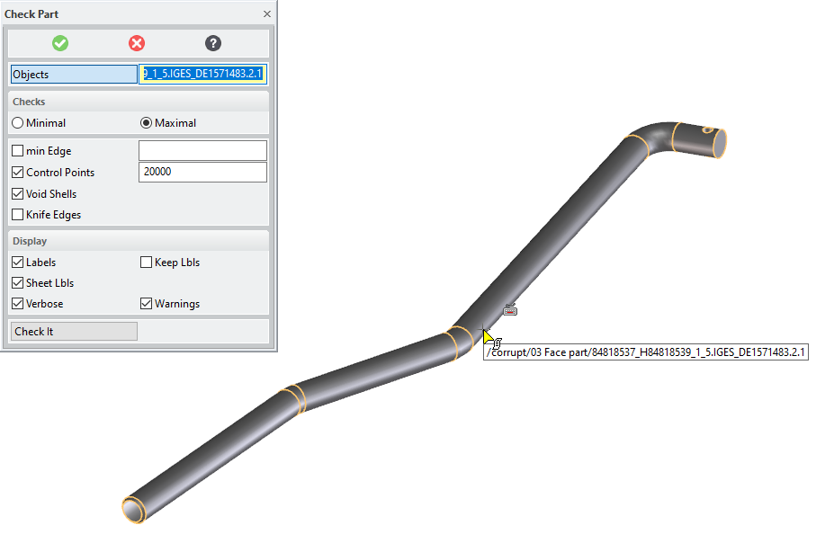

Make sure to keep the 'labels' checked on to view where the problem occurs.

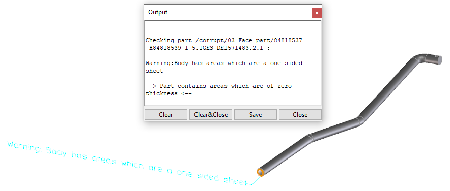

In some cases the function will also heal the part. If you get the following remark when checking a part, the system is working on a fix for it and advises to check it again.

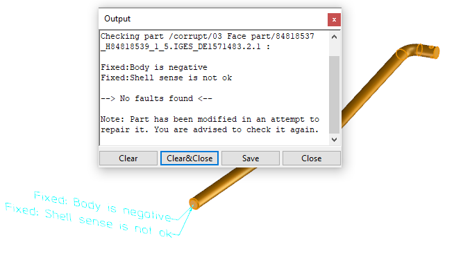

If you check it again, you might get lucky and the system will have successfully healed it.

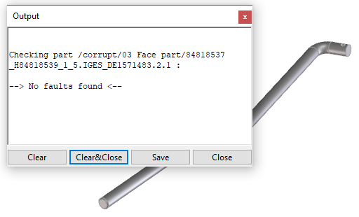

## Recommended types of files

According to the situation, you should opt for these file types:

- **LSP** or **PKG**

  The main advantage of an LSP file is that it's built-in modelling, so there is a low probability of corruption. Even colours and part weight are correct straight from the box.

  A disadvantage of using this type of file is that you need to make a copy before saving it. In case people forget, the system will lock this part and make it impossible to make any adjustments, like changing the part name.
- **STEP**

  Step files are commonly available, but aren't the best option for our drawing program.

  When loading step files, always perform a check part. In most cases the part will be ok. In case the part contains errors, it might still be solvable. If it contains too many errors, switch to the next file type.

  > It can help to adjust the settings in modelling when loading a step file:
  >
  > 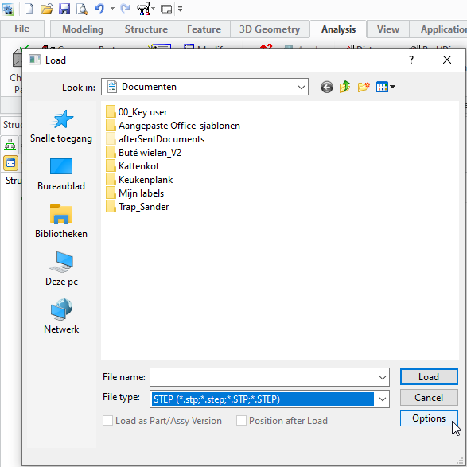
  > 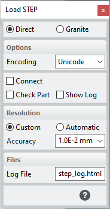
  >
- **SAT** or **IGES**

  SAT and IGES files are also commonly available, but have the big disadvantage that they don't have a build-up structure and just place all parts under the structure browser without an assembly. It's advised to also start with a check part and see if the part is ok or not.

Depending on the situation, some parts will be better in STEP and some will be better in SAT. Feel free to even make combinations of good parts from different files to make an assembly.

## Common problems

**RESOLUTION**

Most problems occur when the resolution of the part is too low. To be consulted under the following tab:

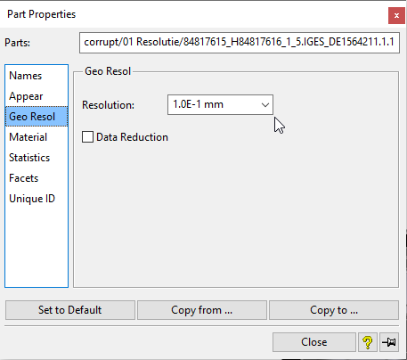

All parts designed in modelling have a standard resolution of 1.0E-5 mm. If the resolution becomes too large and the part has many roundings with a radius or ribs smaller than the resolution, modelling errors will be generated. Manually increasing the resolution under part properties isn't possible.

**Common solutions:**

- **Cut faces**

  By cutting away the faces that give problems, it might be possible to delete the sharp edge that is giving trouble. Just hover over the face and press the 'tab' key until the whole boss or pocket is selected, then use the 'cut' tool.

  In some cases it's not possible to use the 'tab' key. Then it's better to keep pressing the 'shift' key and manually select the faces until it's possible to close the loop and use the 'cut' tool.
- **Cut logos and details**

  Logos and details like threaded holes are often too sharp for the resolution of the part and will cause corruption. Simply delete them using the 'cut' tool.

  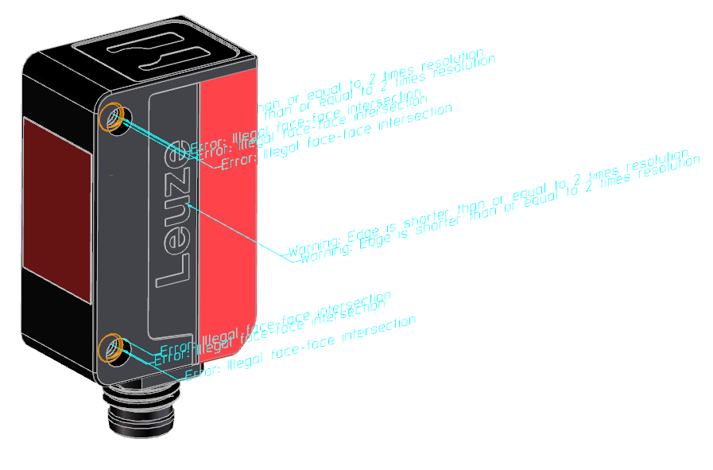
  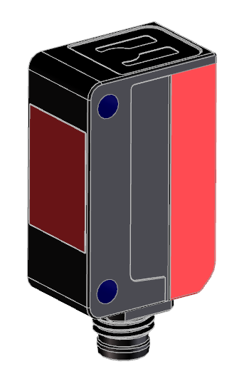
- **Removing edges, roundings and void shells**

  Sharp edges and roundings on a part can also cause corruption. It's best to remove them and, if you like, you can reapply the bend on the edge.

  Keep in mind that bends have a high impact on the details of a part and its file size. If it's not necessary, just avoid them.

  > 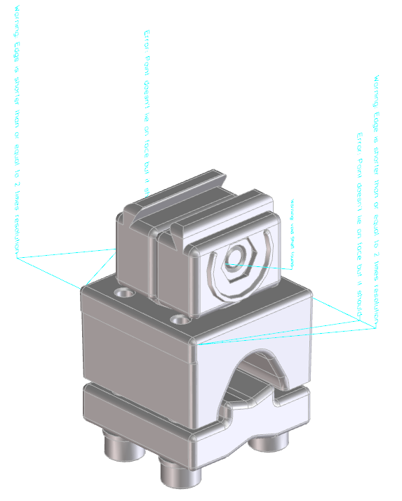
  > 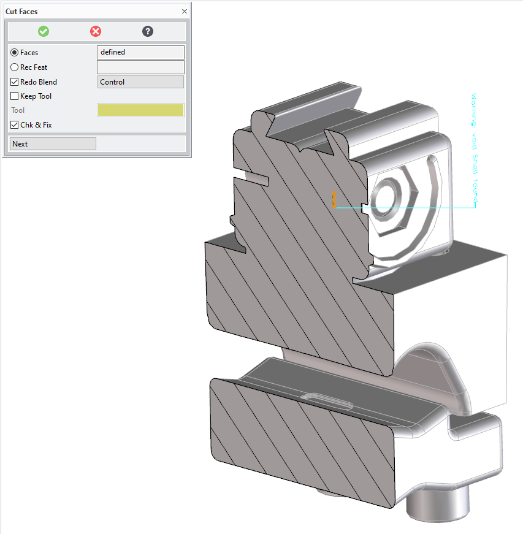
  >
  > Void shells are small pockets inside the solid of a part, often caused by the simplification of the part. Hole clearances for fasteners and plastic flow holes and ribs are an example of this. They can be found by using the 'check part' function; the labels will show their position. Simply cut them away with the 'cut' tool.
  >
- **Too much detail**

  Some models contain too much detail and this requires a lot of calculation to load. If it's not really necessary from a mechanical point of view, delete it.

  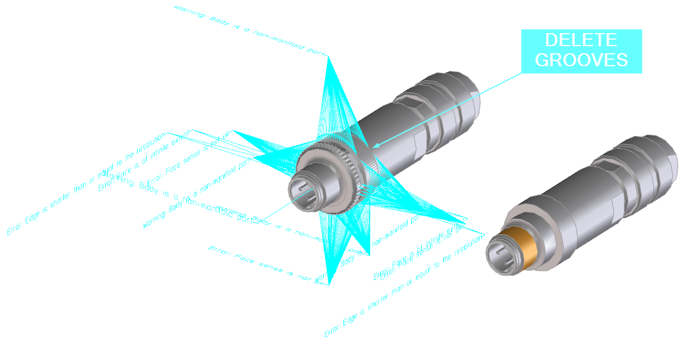
  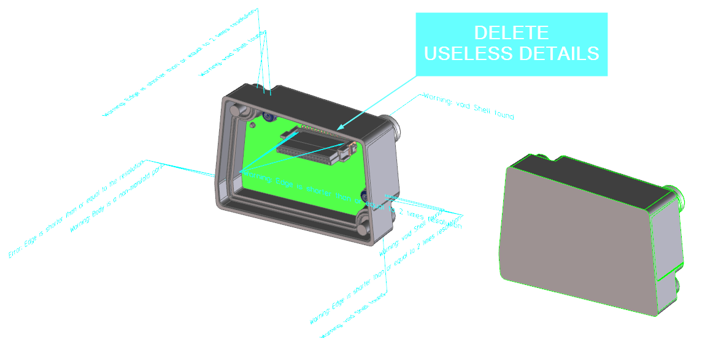
- **Face parts**

  Some parts are missing a face and the system can't calculate it as a solid — this is called a face part. If there are too many faces missing, it's better to try another file type, or another solid that is very similar. But sometimes it's solvable via the following functions:

  - **'Show Gaps'** will indicate where a face is missing and highlight it with orange edges.

    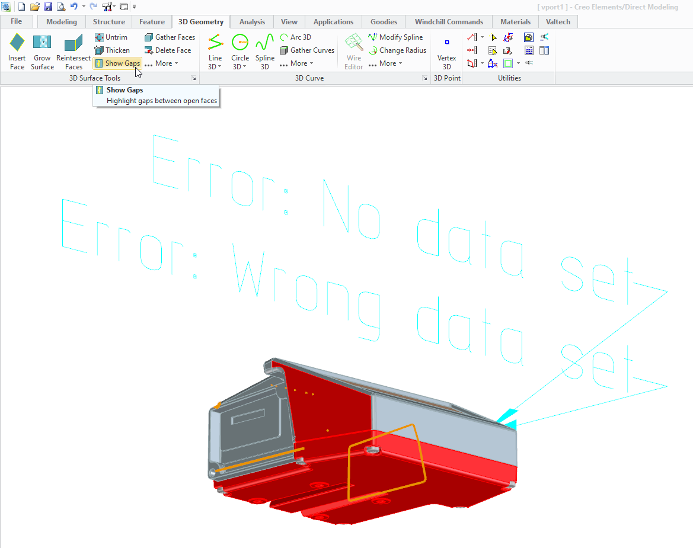
  - Sometimes it's advised to delete surfaces that are causing the problems. The **'Delete Face'** tool can be used to delete as many faces as required.

    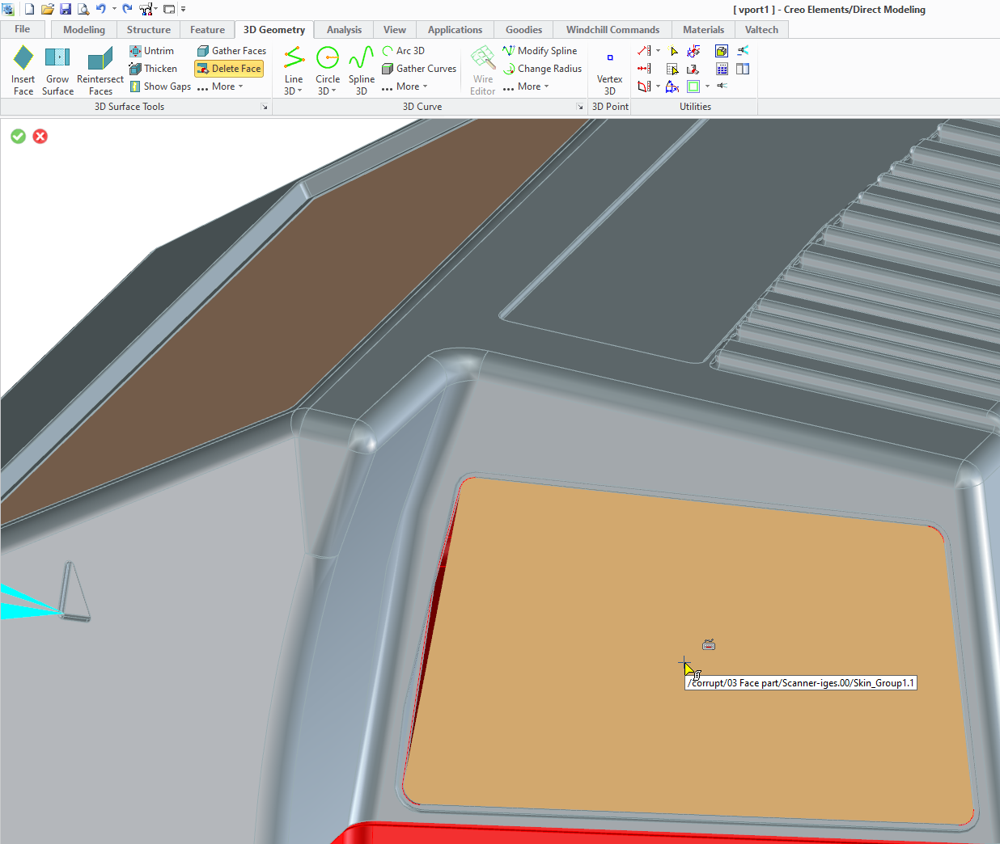
  - With the **'Insert Face'** tool, you generate a face where one was previously deleted, by pressing the 'shift' key and selecting the edges until you connect a loop where the face is missing.

    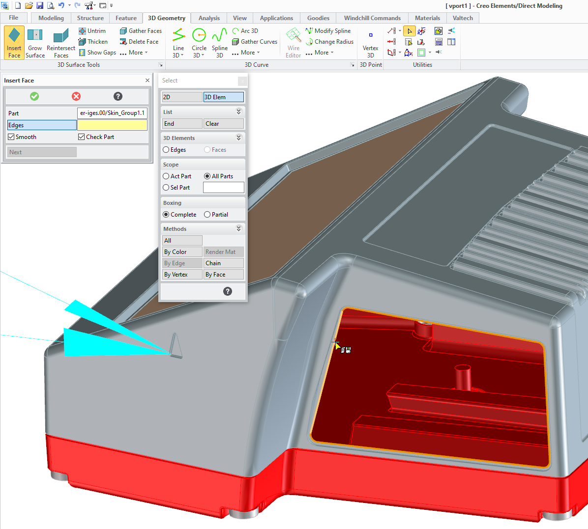
    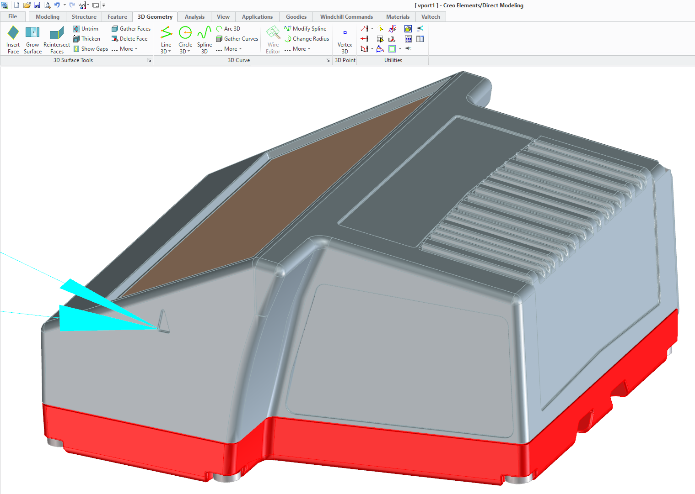
  - Parallel to 'Insert Face', you can use **'Grow Surface'** if the complexity of the part allows it. Keep in mind that 'Grow Surface' is a more automated solving tool that will take longer to be calculated by the system and is more prone to fail. In case the part is too complex, it's preferred to manually cut and insert faces where needed.

    When using the 'Grow Surface' tool, simply select the part. The edges where the face is missing will be indicated in orange.

  > 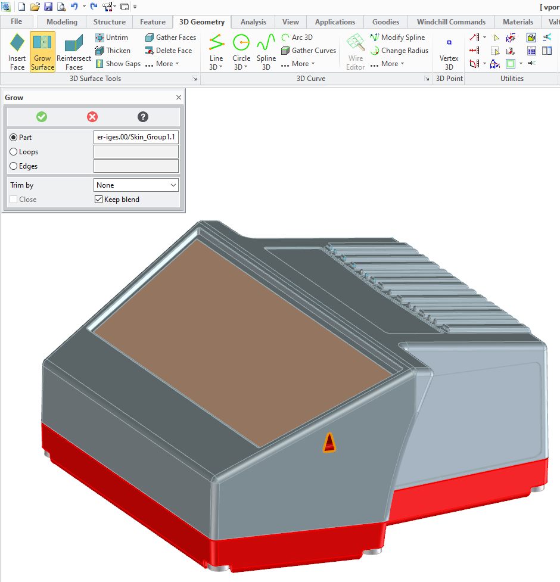
  >
  > If it succeeds, the part will change into a solid instead of a face part.
  >
- **Part corruption too complex to solve**

  In some cases the part will be too corrupt to solve. In this case it's better to search for a better CAD file on the databases, or search our own library for a similar part that might be mechanically the same but has other specifications, and adapt the name and attributes accordingly.

  > Like in this example, we searched the databases for an encoder and found that the model we need is corrupted. After loading different variations of the encoder, we discovered a CAD model that's not corrupt and used this as our base model to save in the system, adapting the name to the one we needed.
  >
  > 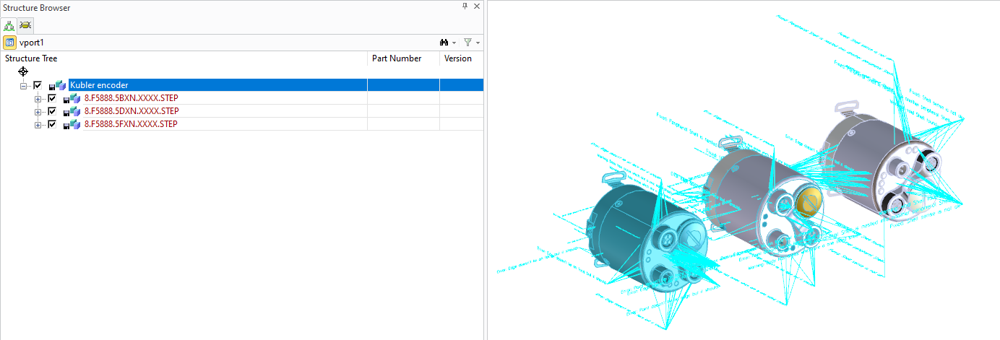
  >
  > If that's not possible, as a last resort, you can always sketch the contours of the part and extrude it so the basic details like mounting hole positions and general size of the part are correct.
  >
  > 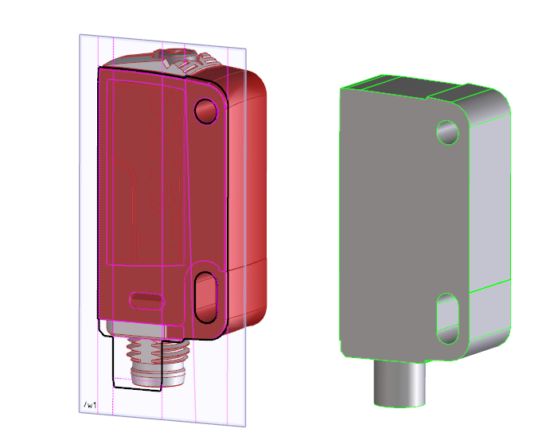
  >

## Simplification

- **Removing unnecessary assemblies, face parts and containers**

  Imported parts can sometimes be stored under a redundant assembly, or can contain containers with quilts due to the program it was originally saved in. It's advised to remove these assemblies and give it an appropriate name.

  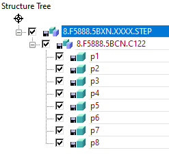
- **Keep it simple**

  To keep the library neat, it's better to save a commercial part as simple as possible. Small details like internal electronics or the balls inside a bearing aren't important for the mechanical installation of the part, so feel free to delete them.

  - If the article doesn't contain specific details that are mechanically important, it is appropriate to save it as a part. By using the **'Unite'** function, you can glue different parts together as one.

    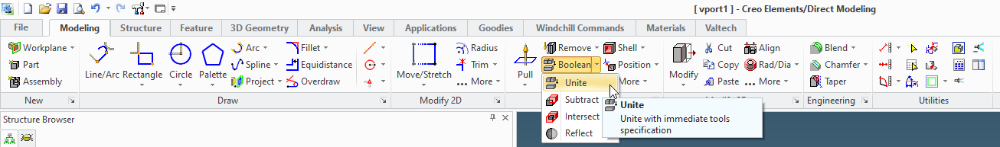

    It's better not to unite all pieces at once, but do it part by part. Each time after uniting 2 parts, perform a check part — that way you can find out which part becomes corrupt and discover why it's happening.

    In this example, the encoder shown above had all unimportant details deleted and all remaining pieces glued together until it became one part.
  - If the article does contain specific details that are mechanically important, it is appropriate to save it as an assembly and set the assembly as inseparable. By using the **'Inseparable'** function, you force the system to only generate an article number for the assembly and not the underlying parts.

    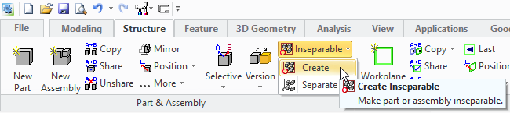

    If we take the example of the encoder again, we see that the mounting bracket can be used for different positions. So it might be better to keep this detail and use the function 'selective unshare' in case the mounting position should change.

    To keep the article as one, we create an assembly containing the encoder, bracket and fasteners. By setting the assembly as inseparable, only the assembly will get an article number and not the underlying parts.

    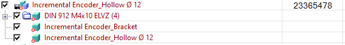

## Healing step by step

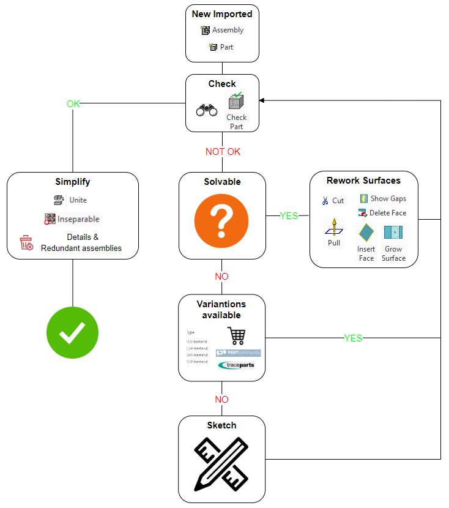
