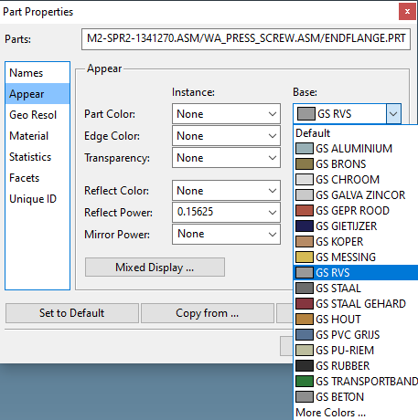
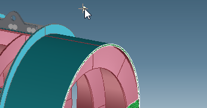

# Database agreements

## Material color

| Material | Part color |
| --- | --- |
| Steel | GS STAAL *(remark: specify RAL color in order)* |
| Stainless steel | GS RVS |
| Galvanized parts | GS GALVA ZINCOR |
| Cruesabro & Hardox | GS STAAL GEHARD |
| PU | GS PU-RIEM |
| Rubber | GS RUBBER |

{ width="280" .center }

Parts that need to be painted use RAL 5011 (not the project color) in the instance color. If only the outer side needs to be painted, use RAL 5011 (not the project color) in the surface color (for example the outside surface of a trommel).

{ width="300" .center }

Steel parts that need to be galvanised: base color GS STAAL; instance color GS GALVA ZINCOR.
