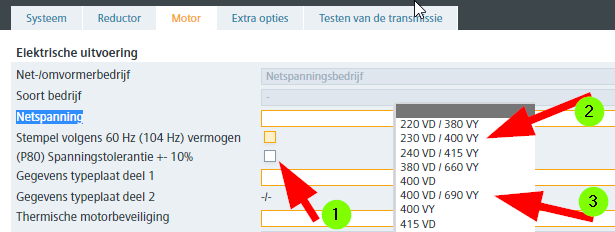
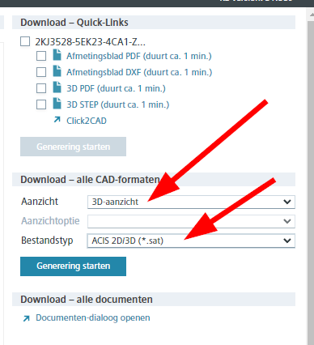

# Geared motors (Siemens)

## Siemens Mall: Select the correct Mains voltage

In the configurator, geared motors of Siemens specify the voltages as follows:

- Select **(1)** standard (P80) tolerance on voltage +/- 10%
- Motors up to and including 7.5 kW: select **(2)** 260/400 V
- Motors > 7.5 kW **with** frequency control: select **(2)** 260/400 V
- Motors > 7.5 kW **without** frequency control: select **(3)** 400/690 V

## Siemens Mall: how to select file type SAT

{ width="350" }
