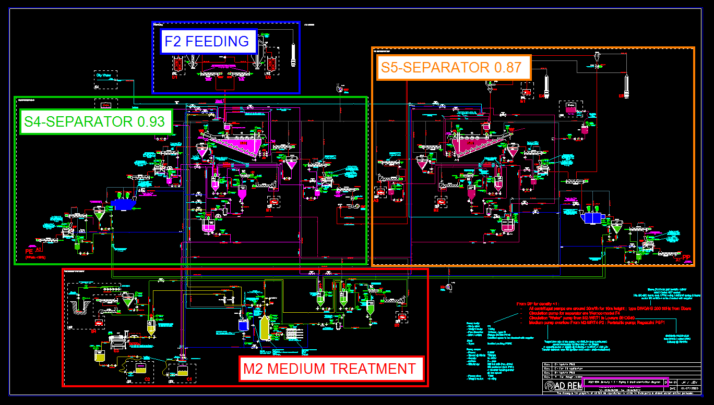
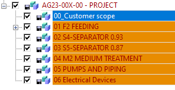
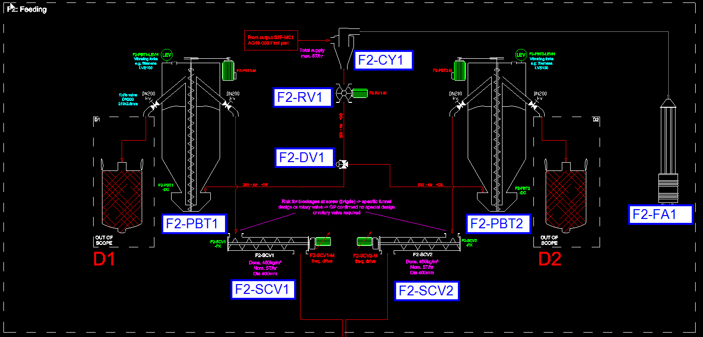
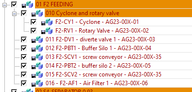
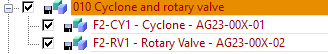
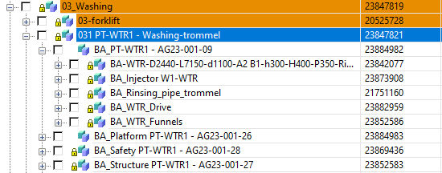
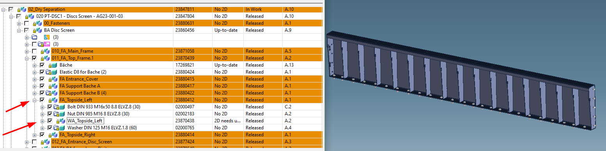
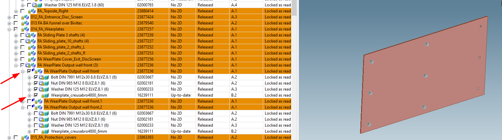

# Guidelines & structure

## Guidelines for a good design

1. Know what the customer wants by reviewing the quote, sales contract, mind reading, and current technology.
2. Make sure your design fulfils all requested functions and explore alternative or cheaper designs.
3. Consider the manufacturing process and use standardization and other resources to optimize production.
4. Make your design user-friendly and easy to operate.
5. Ensure your design is safe for users, bystanders, and the environment by following relevant safety regulations.
6. Account for transportation constraints, such as weight and size limitations, during design.
7. Make sure your design is serviceable with easy-to-access parts for repair, inspection, and adjustment.
8. Choose the best fabrication method and material for each component.
9. Use reliable and readily available commercial components.
10. Allow sufficient clearance between moving parts.
11. Use different materials for sliding components that are exposed to dirt and dust.
12. Lubricate moving parts carefully.
13. Avoid intricate and complex welded assemblies.
14. Provide adequate access and visibility for the welder.
15. Choose the best welding technique for the job.
16. Consider corrosion protection and surface finishes.
17. Create clear and organized plans that leave nothing to chance, with sufficient tolerances and instructions for future reference.
18. Mark necessary measurements in a rational manner.
19. Choose an appropriate paper size for your design drawings.
20. Create a logbook or file with calculations, supplier advice, reports, feedback, and other relevant information about your design.

## Build-up structure in Windchill/CEDM and names

The general rule is that the build-up and naming of the machines and assemblies follow the P&ID and machines list.

### Main file and zones

In the P&ID, the installation is divided into zones. This is the first level of the structure in CEDM.

From this example of P&ID:

Structure CEDM is:

In detail:

- The main assembly name is composed of the project code "AGYY-00X" followed by "-00".
  - YY is the 2 last digits of the year of creation of the project;
  - "X" is an iterative number;
  - The project code is defined by AXAPTA.
- 00_Customer scope: this assembly groups all existing, or to be built, constructions on the project area at customer's site. As examples:
  - Building, concrete boxes, ...
  - Electricity, water, compressed air connections, ...
  - Machines that are not in ADREM's scope
  - Bins, containers, consumables and any other utilities required by the installation
- All zones, organized following the process of material, then other processes and finally general topics:
  - 01 F2 FEEDING until 03 S5-SEPARATOR 0.87 is the process of material
  - 04 M2 MEDIUM TREATMENT is a separate process
  - 05 PUMPS AND PIPING and 06 Electrical Devices are general topics
  - **The names of the zones are the ones from the P&ID!**

!!! note
    All assemblies for zones and general topics have to be toggled Gathering Parts.

### Machines and components

In each zone, the structure follows the flow of the material. In case of a split of the flow, we first follow the heavy fraction (sinking in a separation bath) and then the light one (floating).

The general rule for naming is: `AAA BBB – CCC - AGYY-00X-ZZ`

> Example: `011 F2-DV1 – diverter valve 1 – AG23-00X-03`

- AAA: is an iterative number in the zone (to sort according to the process flow) — `011`
- BBB: is the ID of the machine — `F2-DV1`
- CCC: is the machine name — `diverter valve`
- AGYY-00X-ZZ: is the subcode under which the part will be ordered — `AG23-00X-03`

!!! note
    All assemblies for machines can't be toggled Gathering Parts.

The machine codes are defined in the P&ID and in the machines' list.

It is possible to group machines together under 1 assembly:

In this case, the assembly that groups the machines is toggled gathering part and the name doesn't contain any subproject code.

The name of the assemblies for machines includes the related subproject codes and can't be toggled gathering parts.

!!! note
    Keep in mind that only the assemblies including a subproject code will be set in AXAPTA. That means, for example, that grouping 2 machines with the same subproject code is a nonsense.

### Structure of a machine

A machine must contain all the parts needed to load separately as a whole. For example, the wash drum assembly must contain the following:

- the structure
- the platforms
- the safety grids
- the parts themselves:
  - the drum
  - the drive
  - the injector
  - the funnels
  - ...

The structure of a machine is built up as follows:

1. The top assembly is as described above and is marked as Gathering Part. If there are parts that need to be ordered in another sub-project, the name of the top assembly is without an AG code. The assemblies that need to be ordered in another sub project have, at the end of their name, the subproject code. These assemblies must be used to explode in AX to retrieve the needs.
2. All other assemblies will have the following name `CC_DDD`:
   - CC is:
     - FA = functional assembly
     - WA = weld assembly
     - BA = bolt assembly
   - DDD is the name of the part
3. Bolts in the machine structure: each part or assembly that is mounted in a Bolt Assembly (BA) should be put in a Functional Assembly (FA) together with the fasteners needed to submount the part or assembly. The FA is marked as Gathering Part.

**Example 1:**

**Example 2:**

### Spare parts

When a third party component is used in the project, the spare parts for the component should be added in the assembly. The spare parts need to be placed in a container with the name "SPARE_PARTS" which is set to no scan.
