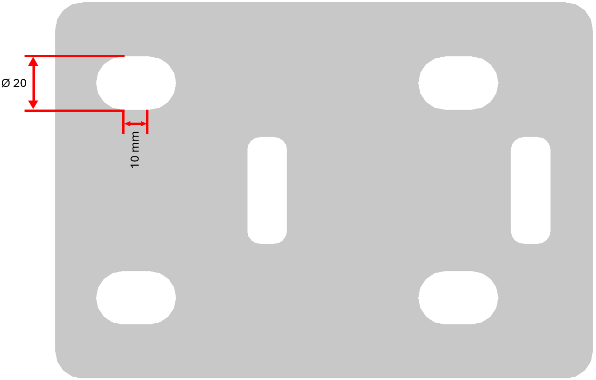

# Hole / slot dimensions

## Holes

**Standard applications**

- Holes in structures and platforms (Hot dip, Steel or stainless steel)
- Stairs and railings
- Structure to structure mounting
- Machine to structure mounting
- Weld steel or stainless steel framework and/or hot dip galvanized framework on which lasered components (cover plates etc.) will be mounted

    | Bolt size | Hole diameter |
    | --- | --- |
    | M8 | Ø10 |
    | M10 | Ø13 |
    | M12 | Ø15 |
    | M16 | Ø20 |
    | M20 | Ø25 |
    | M24 | Ø30 |

**Precise applications:**

- Machine build
- Inox components
- Holes in lasered and bended platework
- Holes in welded assemblies consisting of lasered and bended platework, on condition that the parts are designed with jigsaw pattern or tooth-groove pattern

    | Bolt size | Hole diameter |
    | --- | --- |
    | M8 | Ø9 |
    | M10 | Ø11 |
    | M12 | Ø13 |
    | M16 | Ø18 |
    | M20 | Ø23 |
    | M24 | Ø28 |

## Slots
For the width of the slots, the same rules apply as for holes. The length of the slot is equal to the radius of the slot.

    → Example for galvanized structure:
        - Bolt size = M16
        - Hole diameter = Ø20
        - Slot width = 10 mm
{ width="700" .center }