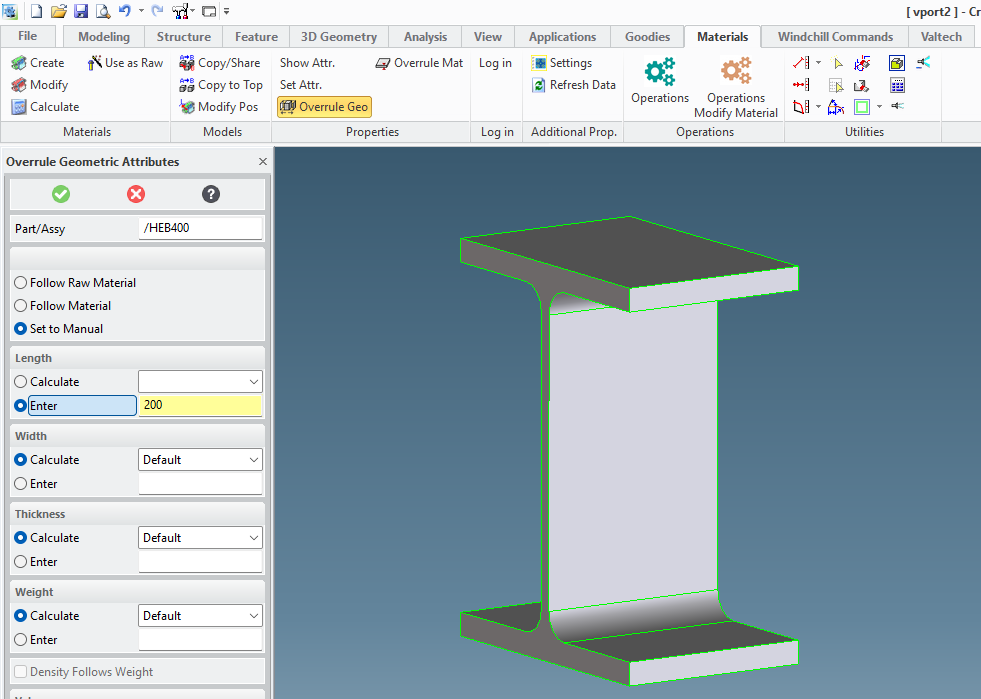

# Info Saw Work SW

If a model is drawn shorter than its width, height or diameter (e.g. a HEB 400 must be sawn to 200 mm), then in Modeling with **Overrule GEO** a measurement must be added to the length of the model. If this is not done, the wrong length will be assigned to this piece.

This is also the way to dimension a flexible pipe (cfr Design playbook *Piping*).

{ .center }