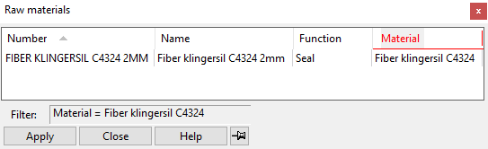
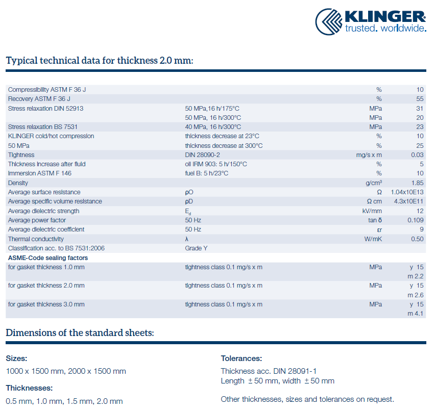

# Mounting machine(parts) on structures

To separate inox parts from galva parts, use this material instead of rubber: Fiber Klingersil C4324 2 mm.

**Advantage:** the thickness doesn't change if there is any pressure on it.

**Color in 3D model:** GS PVC GRIJS

{ width="200" .center }

{ .center }

Example: art **21706208, Fiberseal_Inputbox**

{ .center }
