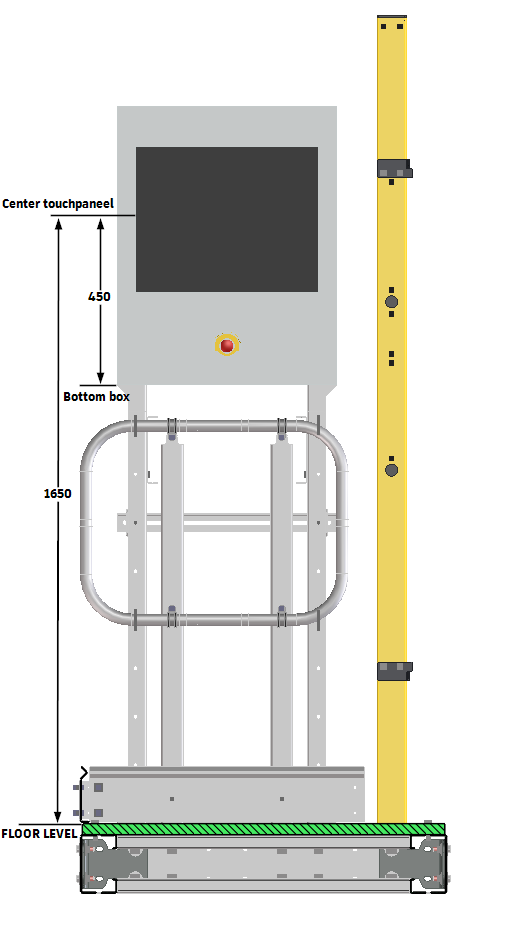

# Norms on electrics

Standard mounting height for a control column with touch panel: 1650mm from floor level to the bottom of the box, and 450mm from the bottom of the box to the center of the touch panel.

{ width="350" .center }
