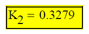
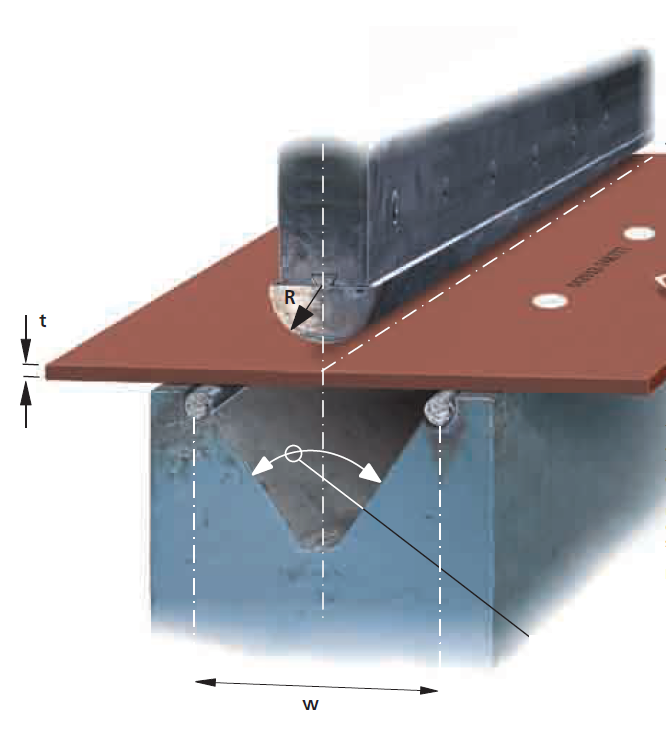

# Sheet metal information

## K-factor Bending

We take the k-factor equal to in sheet metal to unfold plates: *(determined in 2004 by Valvan)*

*For trommels:*

- *conical plates: k=1*
- *cylindrical plates: k=0.5*

{ width="250" .center }

**Bending radius** *(shared by Cretes '2014')*

| Plate thickness t | Inner bend radius R |
| --- | --- |
| 1 | 1.3 |
| 1.5 | 1.9 |
| 2 | 2.6 |
| 3 | 3.8 |
| 4 | 5 |
| 5 | 7 |
| 6 | 8 |
| 8 | 10 |
| 10 | 13 |
| 12 | 15 |
| 15 | 20 |

## Minimum bend radius HARDOX 400

| Plate thickness t | R/t ratio | W/t ratio | Bend R |
| --- | --- | --- | --- |
| 1 | 2.5 | 8.5 | **3** |
| 2 | 2.5 | 8.5 | **5** |
| 3 | 2.5 | 8.5 | **8** |
| 4 | 2.5 | 8.5 | **10** |
| 5 | 2.5 | 8.5 | **13** |
| 6 | 2.5 | 8.5 | **15** |
| 7 | 2.5 | 8.5 | **18** |
| 8 | 3.0 | 10 | **24** |
| 9 | 3.0 | 10 | **27** |
| 10 | 3.0 | 10 | **30** |
| 11 | 3.0 | 10 | **33** |
| 12 | 3.0 | 10 | **36** |
| 13 | 3.0 | 10 | **39** |
| 14 | 3.0 | 10 | **42** |
| 15 | 3.0 | 10 | **45** |
| 16 | 3.0 | 10 | **48** |
| 17 | 3.0 | 10 | **51** |
| 18 | 3.0 | 10 | **54** |
| 19 | 3.0 | 10 | **57** |
| 20 | 4.5 | 12 | **90** |
| >20 | 4.5 | 12 | |

{ width="320" .center }
