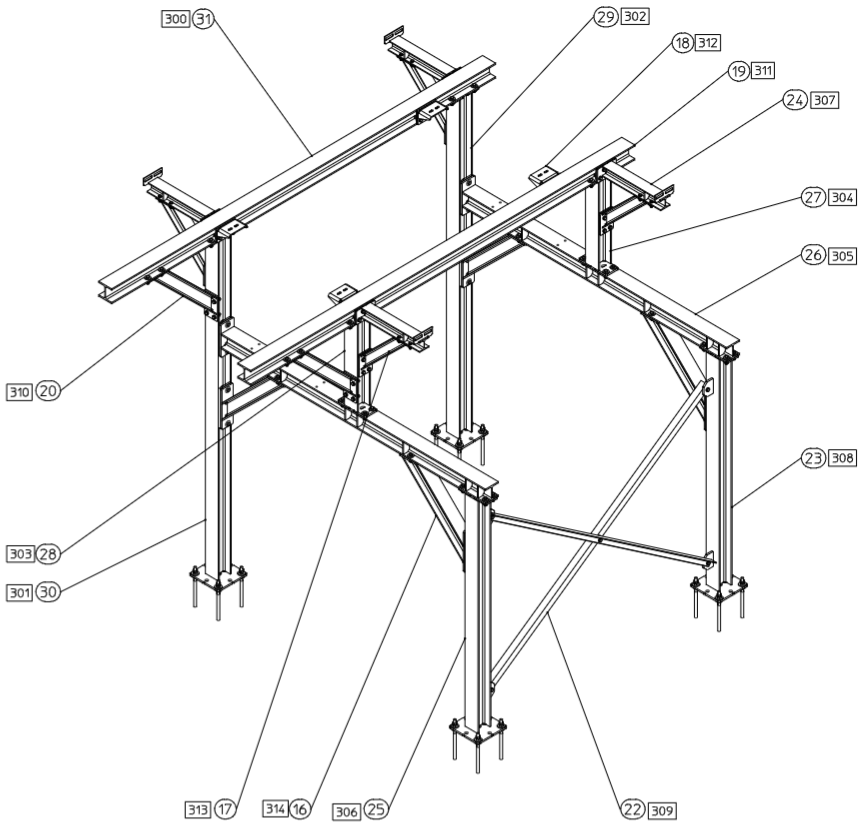
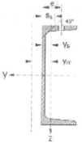
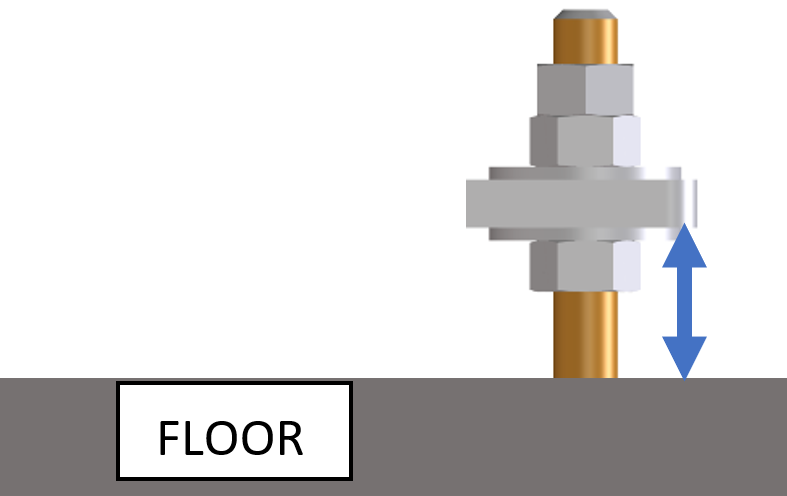

# Structure and platform information

## General rules

- Place slots instead of holes in the lasered plates.
- Keep 50mm distance from the side wall to mount with impact wrench.
- Use round numbers to position the holes (e.g. 10, 20, 100, 150, ...).
- **Connection flanges at least 10mm thickness.**

**Example A**

{ .center }

**Example B**

{ .center }

!!! warning "Remark"
    Don't use vertical slots with horizontal beams, to prevent sliding down.

## Fasteners size

{ .center }

{ .center }

## ID numbering in WA and parts

In each WA or Part we need an ID number welded on it. The ID is made up of three characters: ABB

- A: the ranking number of the zone
- BB: a sequence number (0 to 99, following A0 to A99)

If possible, start the sequence numbers in order of how to build the structure.

The ID's are stored in an Excel called the global numbering file. An example can be found here: `W:\RenD\Projecten 2026\AG26-001 - UDOM - Integration additional equipment\02-Supplier_info\AG26-001-10 - Structures\AG26-001-GLOBAL-Numbering-File.xlsx`

The global numbering file must be used by the supplier to weld the ID number on the parts.

{ .center }

{ .center }

The ID's should also be noted on the 2D drawing of the bolt assembly (BA).

{ .center }

## Profile information

**Allowed tracing dimensions for profiles according to DIN 997**

  
  

<table>
<tr><th>Size</th><th>p</th><th>Size</th><th>e</th><th>Size</th><th>p</th></tr>
<tr><td>IPN 80</td><td>-</td><td>UPN 80</td><td>27</td><td>IPE 80</td><td>-</td></tr>
<tr><td>IPN 100</td><td>-</td><td>UPN 100</td><td>30</td><td>IPE 100</td><td>-</td></tr>
<tr><td>IPN 120</td><td>-</td><td>UPN 120</td><td>35</td><td>IPE 120</td><td>-</td></tr>
<tr><td>IPN 140</td><td>-</td><td>UPN 140</td><td>35</td><td>IPE 140</td><td>-</td></tr>
<tr><td>IPN 160</td><td>-</td><td>UPN 160</td><td>40</td><td>IPE 160</td><td>-</td></tr>
<tr><td>IPN 180</td><td>-</td><td>UPN 180</td><td>40</td><td>IPE 180</td><td>55</td></tr>
<tr><td>IPN 200</td><td>-</td><td>UPN 200</td><td>45</td><td>IPE 200</td><td>60</td></tr>
<tr><td>IPN 220</td><td>58</td><td>UPN 220</td><td>45</td><td>IPE 220</td><td>70</td></tr>
<tr><td>IPN 240</td><td>66</td><td>UPN 240</td><td>50</td><td>IPE 240</td><td>80</td></tr>
<tr><td>IPN 260</td><td>73</td><td>UPN 260</td><td>50</td><td>IPE 270</td><td>85</td></tr>
<tr><td>IPN 280</td><td>79</td><td>UPN 280</td><td>55</td><td>IPE 300</td><td>90</td></tr>
<tr><td>IPN 300</td><td>85</td><td>UPN 300</td><td>60</td><td>IPE 330</td><td>100</td></tr>
<tr><td></td><td></td><td>UPN 320</td><td>60</td><td>IPE 360</td><td>100</td></tr>
<tr><td></td><td></td><td>UPN 350</td><td>60</td><td>IPE 400</td><td>110</td></tr>
<tr><td></td><td></td><td>UPN 380</td><td>60</td><td>IPE 450</td><td>110</td></tr>
<tr><td></td><td></td><td>UPN 400</td><td>60</td><td>IPE 500</td><td>110</td></tr>
<tr><td></td><td></td><td></td><td></td><td>IPE 550</td><td>120</td></tr>
<tr><td></td><td></td><td></td><td></td><td>IPE 600</td><td>130</td></tr>
</table>

<table>
<tr><th>Size</th><th>p</th><th>Size</th><th>p</th><th>Size</th><th>p</th></tr>
<tr><td>HEA 100</td><td>60</td><td>HEB 100</td><td>60</td><td>HEM 100</td><td>70</td></tr>
<tr><td>HEA 120</td><td>70</td><td>HEB 120</td><td>70</td><td>HEM 120</td><td>80</td></tr>
<tr><td>HEA 140</td><td>80</td><td>HEB 140</td><td>80</td><td>HEM 140</td><td>80</td></tr>
<tr><td>HEA 160</td><td>90</td><td>HEB 160</td><td>90</td><td>HEM 160</td><td>90</td></tr>
<tr><td>HEA 180</td><td>100</td><td>HEB 180</td><td>100</td><td>HEM 180</td><td>100</td></tr>
<tr><td>HEA 200</td><td>110</td><td>HEB 200</td><td>110</td><td>HEM 200</td><td>110</td></tr>
<tr><td>HEA 220</td><td>130</td><td>HEB 220</td><td>130</td><td>HEM 220</td><td>130</td></tr>
<tr><td>HEA 240</td><td>150</td><td>HEB 240</td><td>150</td><td>HEM 240</td><td>150</td></tr>
<tr><td>HEA 260</td><td>170</td><td>HEB 260</td><td>170</td><td>HEM 260</td><td>170</td></tr>
<tr><td>HEA 280</td><td>190</td><td>HEB 280</td><td>190</td><td>HEM 280</td><td>190</td></tr>
<tr><td>HEA 300</td><td>210</td><td>HEB 300</td><td>210</td><td>HEM 300</td><td>210</td></tr>
<tr><td>HEA 320</td><td>210</td><td>HEB 320</td><td>210</td><td>HEM 320</td><td>210</td></tr>
<tr><td>HEA 340</td><td>210</td><td>HEB 340</td><td>210</td><td>HEM 340</td><td>210</td></tr>
<tr><td>HEA 360</td><td>210</td><td>HEB 360</td><td>210</td><td>HEM 360</td><td>210</td></tr>
<tr><td>HEA 400</td><td>210</td><td>HEB 400</td><td>210</td><td>HEM 400</td><td>210</td></tr>
<tr><td>HEA 450</td><td>210</td><td>HEB 450</td><td>210</td><td>HEM 450</td><td>210</td></tr>
<tr><td>HEA 500</td><td>210</td><td>HEB 500</td><td>210</td><td>HEM 500</td><td>210</td></tr>
<tr><td>HEA 550</td><td>210</td><td>HEB 550</td><td>210</td><td>HEM 550</td><td>210</td></tr>
<tr><td>HEA 600</td><td>210</td><td>HEB 600</td><td>210</td><td>HEM 600</td><td>210</td></tr>
<tr><td>HEA 650</td><td>210</td><td>HEB 650</td><td>210</td><td>HEM 650</td><td>210</td></tr>
<tr><td>HEA 700</td><td>210</td><td>HEB 700</td><td>210</td><td>HEM 700</td><td>210</td></tr>
<tr><td>HEA 800</td><td>210</td><td>HEB 800</td><td>210</td><td>HEM 800</td><td>210</td></tr>
</table>

## Chemical anchor information

**Application:** Heavy structures / machines / tanks that are NOT mounted directly to the floor.

**Bolt connection** — Fasteners material: Hot dip galvanized

{ width="180" .center }

Above the mount plate:

| Component | Standard / norm |
| --- | --- |
| Threaded rod | |
| 2x Hexagon nut | DIN 934 |
| Large plain washer | DIN 9021 |

Underneath the mount plate:

| Component | Standard / norm |
| --- | --- |
| Large plain washer | DIN 9021 |
| Hexagon nut | DIN 934 |

**Hole dimensions**

| Thread size | Hole size in mount plate |
| --- | --- |
| M16 rod (18mm bore) | 24mm |
| M20 rod (22mm bore) | 28mm |
| M24 rod (28mm bore) | 34mm |

**Hole positioning**

=== "General conditions"
    { width="260" .center }

=== "With obstacles in 1m range above the mount plate"
    { width="260" .center }

**Mount position**

{ width="300" .center }

For standard applications inside a building, the floorplate should be at a height of **50mm**.

## Mechanical anchor information

**Application:** Small structures / machines / tanks that are mounted directly to the floor.

**Types:**

{ width="200" .center }

| Size | Reference |
| --- | --- |
| M8 | M8/20x80 ELVZ *(remark: only to secure electrical cabinets)* |
| M12 | M12/80x160 ELVZ |
| M16 | M16/100x220 ELVZ |

Hole dimensions according to the [Hole / slot dimensions](Hole-slot-dimensions.md) standard applications.

## Boplan information

Place the conical stopper at a distance center to center of **60mm** (on new model from 2024). This prevents opening of the door by itself. This will create a slight overlap in the CAD file.

{ width="500" .center }
